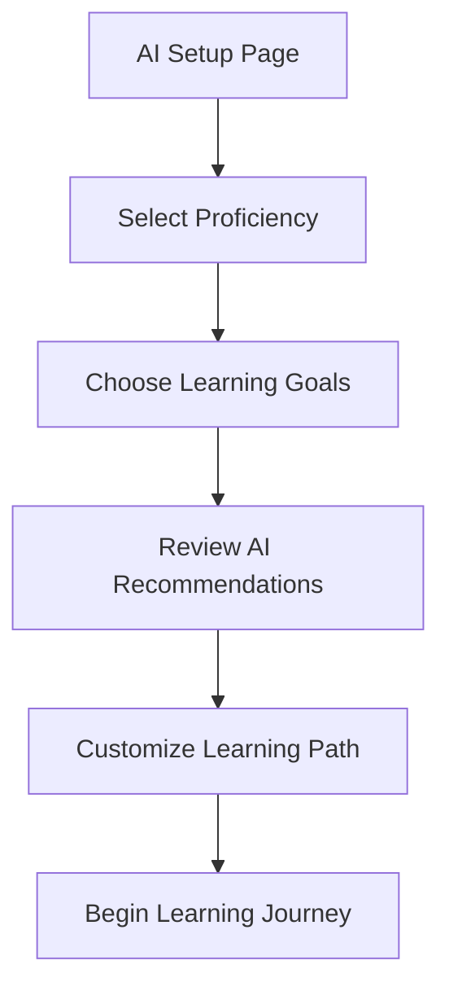

## Overview

Users configure their AI learning experience by:
- Selecting their proficiency level
- Choosing learning goals
- Receiving AI-generated recommendations
- Customizing their learning path

The AI then tailors content and interactions based on these preferences.

## User Flow

## UI Prototype

### Customize Your AI Learning Experience
**Let's personalize your learning journey**

#### Your Proficiency Level
- [ ] Beginner
- [ ] Intermediate
- [ ] Advanced

#### Learning Goals
- [ ] Read Classical Texts
- [ ] Understand Quran
- [ ] Daily Conversation
- [ ] Academic Writing

### AI Recommendations
Based on your selections, we recommend:
- Start with foundational grammar lessons
- Focus on vocabulary building
- Practice with interactive exercises
- Engage with community discussions

[Start Learning](#)

## Technical Implementation Notes

- AI customization should:
  - Process user selections in real-time
  - Generate personalized learning paths
  - Adapt difficulty based on progress
  - Store preferences for future sessions
- Learning path generation should:
  - Consider multiple learning goals
  - Balance different types of content
  - Provide achievable milestones
  - Update based on performance
- System should:
  - Use machine learning models
  - Support real-time recommendations
  - Track learning effectiveness
  - Allow path adjustments 