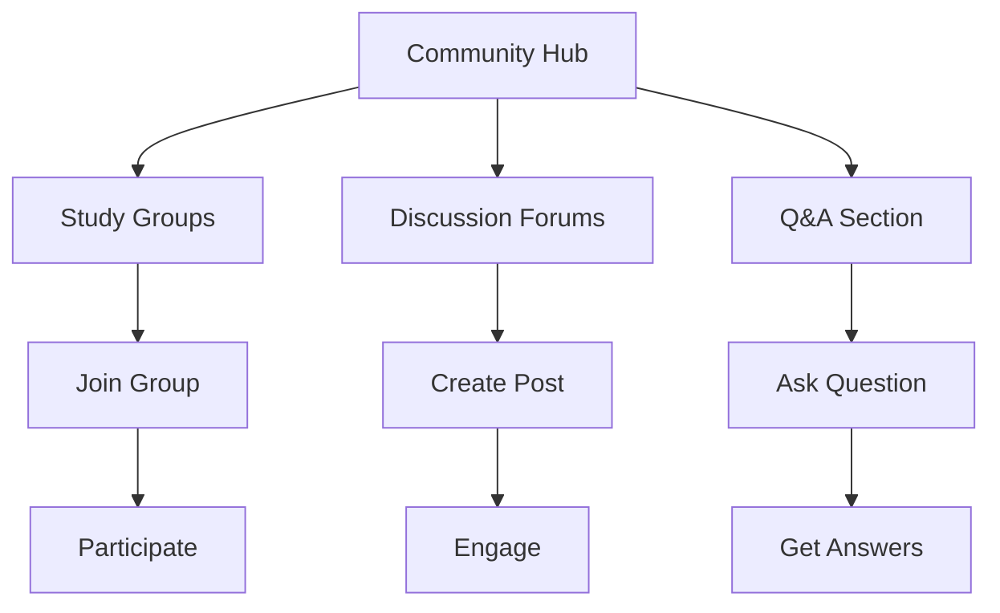

## Overview

The community system enables users to:
- Join study groups and discussion forums
- Participate in Q&A sessions
- Share learning resources
- Connect with native speakers
- Track reputation and contributions
- Receive community badges

## User Flow

## UI Prototype

### Community Hub
#### Active Study Groups
- **Quranic Arabic Study** (15 members • Intermediate) [Join]
- **Classical Literature Club** (8 members • Advanced) [Join]
- [Create New Group]

#### Recent Discussions
- **Tips for Memorizing Vocabulary** (23 replies • 2 hours ago) [Hot]
- **Best Resources for Grammar** (15 replies • 5 hours ago) [New]
- [Start New Discussion]

#### Questions & Answers
- **Difference between ث and س?** (3 answers • Pronunciation) [Answered]
- **When to use dual form?** (1 answer • Grammar) [Open]
- [Ask Question]

### Your Profile
**Ahmed** (Intermediate Level • 150 Points)
- [Helper] [Active]

## Technical Implementation Notes

- Community system should:
  - Support real-time updates
  - Handle user permissions
  - Implement moderation tools
  - Track engagement metrics
- Study groups should:
  - Enable group chat
  - Support file sharing
  - Schedule events
  - Track participation
- Discussion forums should:
  - Support rich text
  - Enable notifications
  - Allow categories
  - Track popularity
- Q&A system should:
  - Support markdown
  - Enable voting
  - Track accepted answers
  - Award reputation points
- User profiles should:
  - Track contributions
  - Display badges
  - Show activity history
  - Calculate reputation 