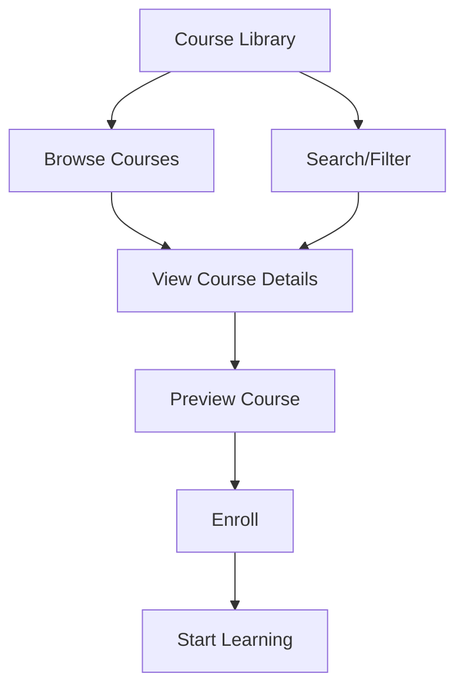

## Overview

The course library provides users with:
- A comprehensive catalog of Arabic language courses
- Search and filtering capabilities
- Course previews and descriptions
- Progress tracking for enrolled courses
- Recommendations based on skill level

## User Flow

## UI Prototype

### Course Library
#### Search Courses
[Search courses...][Search]

#### Filters
- Level: [Beginner] [Intermediate] [Advanced]
- Category: [Grammar] [Vocabulary] [Conversation] [Literature]

#### Courses
- **Foundations of Arabic Grammar** (20 lessons • 8 hours) [Start Course]
- **Essential Vocabulary** (15 lessons • 6 hours) [Continue]
- **Classical Arabic Literature** (25 lessons • 12 hours) [Start Course]

## Technical Implementation Notes

- Course catalog should:
  - Support dynamic loading
  - Implement efficient search
  - Enable complex filtering
  - Cache course data
- Course previews should:
  - Load quickly
  - Show relevant metadata
  - Support rich media
  - Track user engagement
- Enrollment system should:
  - Handle user registration
  - Manage course access
  - Track progress
  - Support resuming
- Search functionality should:
  - Use elasticsearch
  - Support fuzzy matching
  - Filter by multiple criteria
  - Sort by relevance 