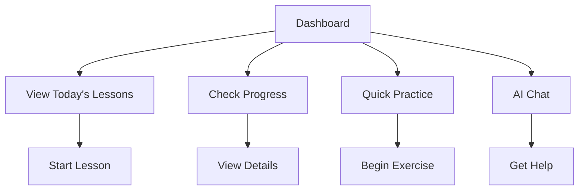

## Overview

The dashboard serves as the main hub for users to:
- View today's lessons and upcoming content
- Track learning progress and achievements
- Access quick practice activities
- Interact with the AI tutor
- Review learning statistics

## User Flow

## UI Prototype

### Today's Lessons
- **Basic Grammar: Verb Forms** (Duration: 15 minutes) [Start]
- **Vocabulary: Family Terms** (Duration: 10 minutes) [Start]

### Progress
- Weekly Goal: 4/5 days
- [Progress Bar]

### AI Tutor
Need help with your studies? Ask me anything!
[Type your question...] [Ask]

### Quick Practice
- [Daily Challenge]
- [Writing]
- [Speaking]
- [Flashcards]

## Technical Implementation Notes

- Dashboard layout should:
  - Be responsive across devices
  - Support real-time updates
  - Cache data for performance
  - Handle offline mode gracefully
- Progress tracking should:
  - Update in real-time
  - Store metrics securely
  - Support multiple progress types
  - Provide detailed analytics
- AI chat integration should:
  - Handle multiple message types
  - Support rich text responses
  - Maintain conversation context
  - Provide quick suggestions
- Quick practice should:
  - Load activities instantly
  - Track completion status
  - Adapt difficulty levels
  - Support offline mode 