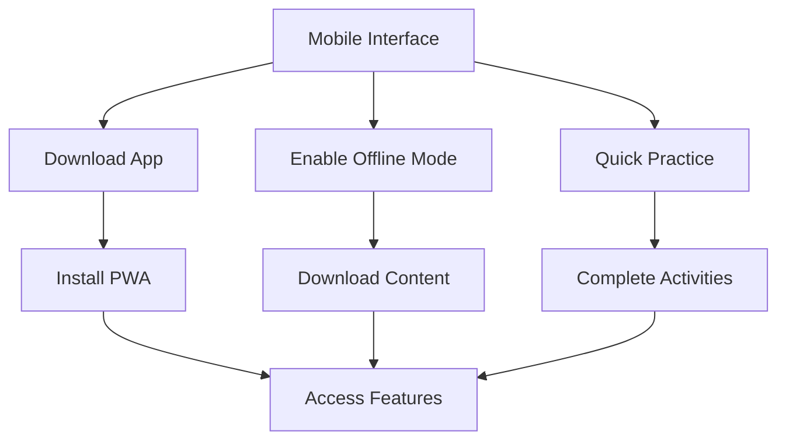

## Overview

The mobile interface provides:
- Responsive design for all screen sizes
- Native app experience via PWA
- Offline learning capabilities
- Touch-optimized interactions
- Quick access to essential features
- Synchronized progress across devices

## User Flow

## UI Prototype

### Mobile App
[Download App] (Available for iOS and Android)

### Offline Mode
- Enable Offline Mode: [Switch]
- Progress: 1.2GB of 1.8GB downloaded

### Quick Practice
- **5 min exercises** [Start]

### Daily Review
- **10 cards due** [Review]

### Today's Progress
- Daily Goal: 15/20 minutes
- [Progress Bar]

## Technical Implementation Notes

- Mobile app should:
  - Implement PWA features
  - Support offline functionality
  - Optimize performance
  - Handle touch interactions
- Offline mode should:
  - Download essential content
  - Manage storage efficiently
  - Sync when online
  - Handle conflicts
- Quick practice should:
  - Load instantly
  - Work offline
  - Save progress locally
  - Sync when possible
- UI components should:
  - Be touch-friendly
  - Support gestures
  - Adapt to screen sizes
  - Handle orientation changes 