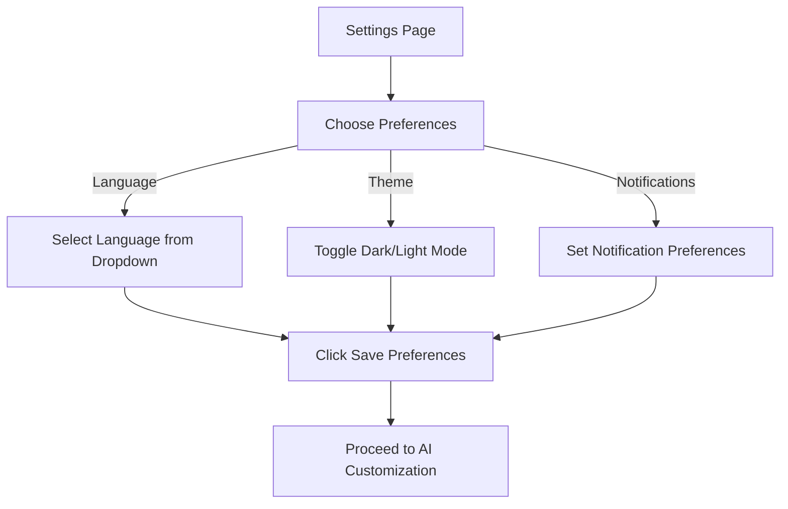

## Overview

Users customize their profile settings. On the Settings page they:
- Select a preferred language from a dropdown menu
- Toggle between dark and light modes using a switch
- Set notification preferences with checkboxes or toggle buttons

Once selections are made, they click "Save Preferences" to continue to the AI customization step.

## User Flow

## UI Prototype

### Personalize Your Experience
#### Language
- [Select language: English | العربية | Français]

#### Theme
- [Light] [Dark]

#### Notifications
- [ ] Lessons
- [ ] Progress
- [ ] Community

[Save Preferences](#)

## Technical Implementation Notes

- Language preferences should:
  - Update UI text immediately
  - Persist across sessions
  - Support RTL languages
- Theme implementation should:
  - Use CSS variables for consistent theming
  - Support system preference detection
  - Apply smoothly with transitions
- Notification settings should:
  - Sync with backend preferences
  - Handle push notification permissions
  - Support email and in-app notifications separately 