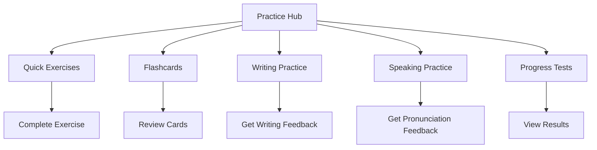

## Overview

The practice system offers users multiple ways to reinforce their learning:
- Quick exercises for daily practice
- Spaced repetition review system
- Interactive flashcards
- Progress tests
- Writing practice with feedback
- Speaking exercises with pronunciation feedback

## User Flow

## UI Prototype

### Quick Exercise
**Translate to Arabic:**
"The book is on the table"
[Type your answer...] [Check Answer]

### Flashcards
**كتاب** [Click to flip]
[Previous] [Next]

### Writing Practice
**ك** [Draw this character] [Submit]

### Speaking Practice
**مرحبا**
[Record] [Listen]

### Progress Test
20 questions • 15 minutes
[Covers recent lessons] [Start Test]

## Technical Implementation Notes

- Exercise generation should:
  - Use spaced repetition algorithms
  - Adapt to user performance
  - Generate varied content
  - Track error patterns
- Flashcard system should:
  - Support multimedia content
  - Use SRS scheduling
  - Allow custom decks
  - Track review history
- Writing practice should:
  - Use stroke detection
  - Provide real-time feedback
  - Support different scripts
  - Save practice history
- Speaking practice should:
  - Use speech recognition
  - Analyze pronunciation
  - Provide audio feedback
  - Support different dialects
- Progress testing should:
  - Generate balanced tests
  - Adapt difficulty
  - Provide detailed analysis
  - Track improvement 