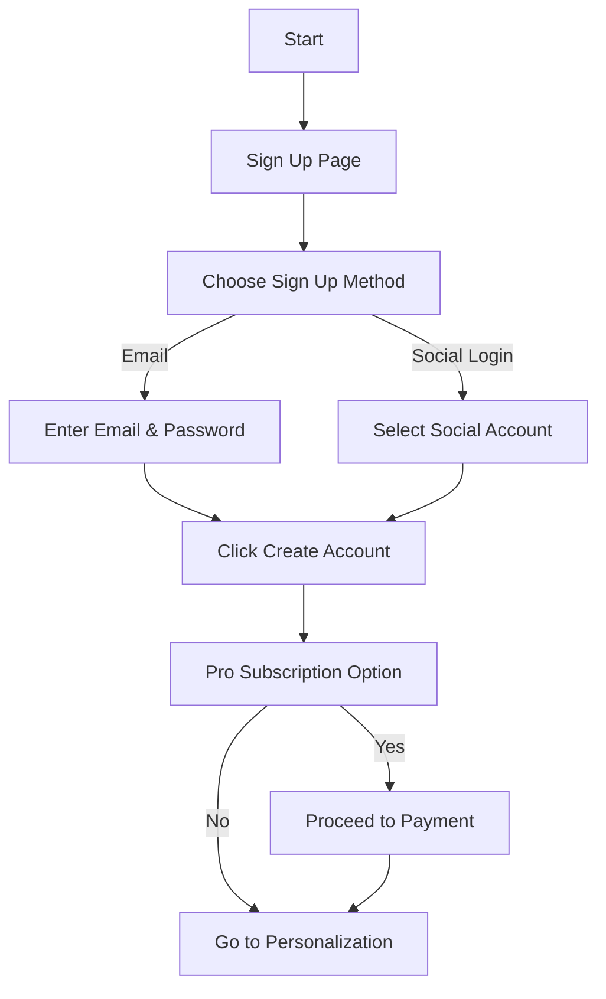

## Overview

Users begin by registering an account. On the Sign-Up page, they are given two options:
- Enter their email and password
- Click a social login button

After filling out the appropriate form fields, they click the "Create Account" button. If users opt for a Pro subscription, they are directed to the payment interface.

## User Flow

## UI Prototype

### Create Account
#### Email Signup
- Email: [Enter your email]
- Password: [Create a password]
[Create Account]

#### Social Login
- [Google]
- [Facebook]
- [Apple]

*After signup, you'll have the option to upgrade to Pro for additional features.*

## Technical Implementation Notes

- Form validation should include:
  - Email format verification
  - Password strength requirements
  - Duplicate email checking
- Social login implementations should use official SDKs
- Pro subscription flow should integrate with payment processor
- All form submissions should be protected against CSRF
- Implement rate limiting for sign-up attempts 